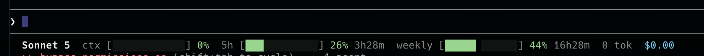

# claude-usage-statusline

A [Claude Code](https://claude.com/claude-code) plugin: a single-file, dependency-free status line showing model, context usage, 5-hour and weekly rate-limit windows, token count and session cost — all on one line.



```
Sonnet 5  ctx [            ]  0%   5h [██████      ] 26%  3h28m   weekly [████████    ] 44%  16h28m   0 tok  $0.00
```

## Install

```
/plugin marketplace add savinofiore/claude-usage-statusline
/plugin install claude-usage-statusline@claude-usage-statusline
```

Start a new session — a `SessionStart` hook wires the statusline into `~/.claude/settings.json` automatically. It's idempotent and never overrides a statusline you already have; if it finds one, it tells you instead of touching it (see **Manual install** below).

## Requirements

- Python 3 (stdlib only, no `pip install` needed)

## Manual install

If you don't use the plugin marketplace, or the hook found an existing statusline, add this to `~/.claude/settings.json` yourself, pointing at `hooks/usage-statusline.py` from this repo:

```json
{
  "statusLine": {
    "type": "command",
    "command": "python3 /path/to/claude-usage-statusline/hooks/usage-statusline.py"
  }
}
```

## How it works

Claude Code pipes a JSON payload (model info, context window, rate limits, cost) to the statusline command on stdin. The script reads it and prints one ANSI-colored line: bars turn green → yellow → orange → red as each budget fills up.

## Uninstall

```
/plugin uninstall claude-usage-statusline@claude-usage-statusline
```

This doesn't remove the `statusLine` entry from `settings.json` — delete it by hand if you no longer want the badge.

## License

MIT — see [LICENSE](LICENSE).
